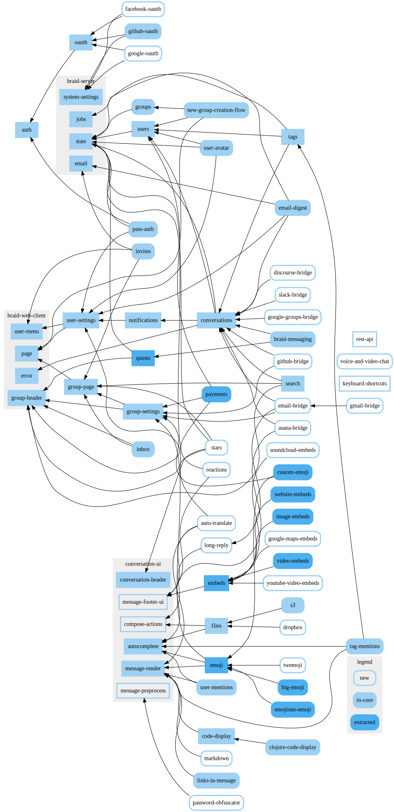

# Braid Module Graph

A small project to help plan out the extraction of modules from Braid's core. See this issue (https://github.com/braidchat/braid/issues/117) for context.

To run:
 
  - clone this project
  - `lein repl`
  - `(start!)`
  - open `http://localhost:6123`

Modules are defined in [src/braid_module_graph/modules.cljc](./src/braid_module_graph/modules.cljc)

Latest graph: [module-graph.svg](./module-graph.svg)

